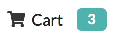
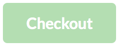

# An e-shop example

## Lab Practice: Full-Stack development

All the code boilerplate will be available from here. Once you download the boilerplate code you can issue the command `npm install`, that will install all the relevant npm packages.

The `package.json` scripts available are the following:

1. `npm run build` builds the whole application (client/server);
2. `npm run build-client` builds the client part;
3. `npm run build-server` builds the server part;
4. `npm run seeder` loads the initial content in the database;
5. `npm run serve` runs the web application.

To solve these exercises you should form groups.

Our goal is to develop a few functionalities of the e-shop application and to beautify the interface.

The `/products` page shows the products that are available in the shop and allow to **Add to cart** each of them (i.e., add them to an array stored locally in the browser through the `store` library).

### Exercise 1 (client)

Add a new menu item in the navigation menu for the `/cart` page. It should show a `cart` icon and a `
X
` label that will contain the number of items in the cart (`(store.get('cart') || []).length`). The menu item should direct to a “Cart” view component that will be defined later.

### Exercise 2 (client)

Modify the function that handles the click on the “Add to Cart” in the `product-list.js` file. Currently it just adds the newly bought item in the `store`, but we also require that it updates the `.cart-items` label so that it shows the current number of items in the cart (i.e., `cart.length`).

### Exercise 3 (client, server communication)

Modify the `Cart` class in the `cart.js` file to show the details of the cart content. Indeed, in its current implementation only the `id` of the items in the chart is shown, therefore a (sequence of) accesses to the `/api/product/:id` REST mount point should be done in order to retrieve the details of each bought item.

**Note**: you might find useful to use the `Promise.all([p1, p2, ...])` composite promise, that is fulfilled when all the composing promises are fulfilled.

In particular, in the table, for each item, there should be present its unit price, its name and the quantity currently present in the cart. Moreover, there should be a grand total of the all amounts.

### Exercise 4 (client)

Beautify the Cart table with a `semantic-ui` [table](https://semantic-ui.com/collections/table.html) styling.

### Exercise 6 (client)

Add a `Checkout` button to the Cart view. This button should be disabled if the user is not logged in (`store.get('logged_in')` is `undefined`). 

### Exercise 7 (server, model)

Define a new `Order` model on the server (fill in the `models/order.js` file). This model should store the order of a given user to complete the checkout process.

In particular it must refer to a valid `User` and to an array of `Product` ids with their prices (at the moment when the order is issued).

### Exercise 8 (server, route)

Define a new `/api/orders` Express route (fill in the `orders.js` file and attach it to the server app in the `index.js` file). In particular the `POST` method on that route should create a new `Order` with some JSON information coming from the client.

### Exercise 9 (client, server communication)

Create the event handler for the `Checkout` button in the `Cart` view that will send the data to the `/api/orders` route defined in the previous exercise.

### Exercise (optional, client)

Add a `+` and `-` button to each row of the `Cart` table, so that the user can increase or decrase the quantity of the item (the `cart` field in the `store` must be updated accordingly).

### Exercise (optional, client)

In the `Cart` view, add a `Login` button (that forwards to `/login`) that should be visible near to the `Checkout` one when the user is not logged in. If the user is, instead, logged in, the `Login` button in the Cart view must be hidden.

### Exercise (optional, server)

Define the function for handling `GET` requests to `/api/orders`. In particular, that function should return the orders of the currently logged in user (using the information obtained through JWT authorization, i.e., `req.user`).

### Exercise (optional, client)

Define a new `/orders` functionality that 

1. is available only for logged in users;
2. allows to get the information of the list of orders issued by the current user.

Add a new navigation menu item for accessing this new functionality.

